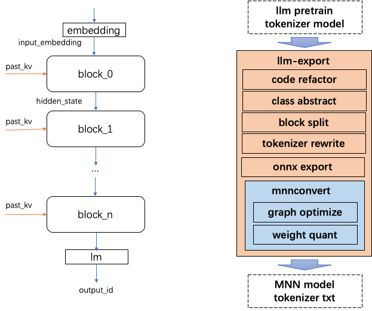
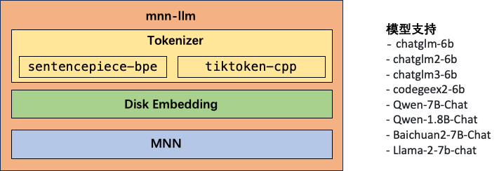
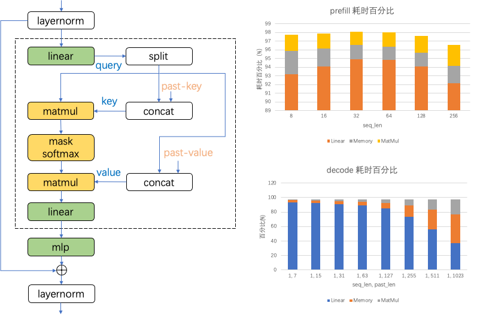
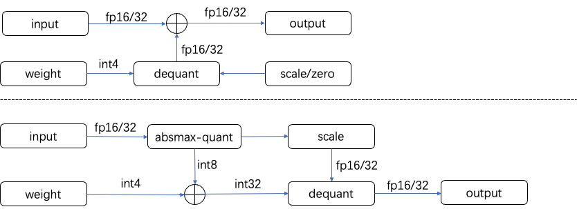
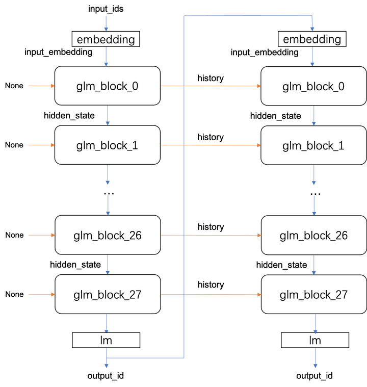

## mnn-llm手机端部署大语言模型

### 以Qwen1.5-0.5B-chat模型为例详细介绍mnn-llm的使用和在Android端的部署

DataXujing

mnn-llm原来只支持特定模型的 ChatGLM-MNN 项目已升级并更名为 mnn-llm，并集成到了MNN项目中；该项目支持多个目前主流的开源LLM模型的部署。与此同时，为了简化不同 LLM 模型向 ONNX 格式导出的流程，mnn-llm团队推出了 llm-export 项目。该项目为多种 LLM 模型提供了统一的导出方案，大大地降低了从预训练模型导出的复杂度。本项目实现了基于mnn-llm的模型转换，windows下的编译和基于QT的android端的编译和调用，并测试了Qwen1.5-0.5B模型在android端的部署。

### 1.模型导出

在将深度学习模型从研究原型转换为实际可部署的产品时，模型导出阶段的顺畅与否对于整个工作流程至关重要。通常，这个过程涉及将模型从训练框架中导出到一个中间表示，如 ONNX（开放神经网络交换格式），然后再转换为目标部署框架——在本例中为 MNN格式。为了简化并标准化这一过程，mnn-llm团队开发了一个名为 llm-export 的工具。

llm-export 工具的核心思想在于对大型语言模型（LLM）进行了高度抽象，建立了一个统一化的导出框架。**这个项目的目标是消除将各种 LLM 模型导出到 ONNX 格式的障碍，确保无论是何种架构的 LLM 都能通过一个清晰定义的接口进行处理**。在 llm-export 中，我们定义了一套公用的导出逻辑，这意味着对于任何特定的 LLM，开发者只需实现模型的加载逻辑。这极大地减少了从多样化的训练环境向 ONNX 模型迁移的复杂性，并显著提高了整个导出过程的易用性。**模型一旦被成功导出至 ONNX，即可利用现有的mnnconvert工具转换到 MNN 格式，从而使用MNN完成llm模型的推理**。



如上图所示： llm-export中将llm模型抽象为4部分：tokenizer, embedding, blocks, lm

> 模型导出的Trick：模型拆分优化

以ChatGLM-6B为例，首先直接使用torch.onnx.export尝试对模型进行ONNX导出，导出过程非常缓慢，导出后模型的权重大小有28G。在将模型转换到MNN时会执行一些图优化；因为模型太大导致占用内存过高速度非常慢；因此考虑将模型进行拆分优化。拆分之后的优化考虑如下：

+ Embedding层的参数大小为`150528 * 4096`, 单个权重使用内存非常大；考虑到输入文字数量较小（相对于150528），使用Gather实现消耗大量内存/显存，直接将参数存储为二进制文件，通过fseekfread实现Gather的操作能够在稍微牺牲速度的情况下节约2.3G内存；
+ GLMBlock层的权重总大小为21G，仍然非常大，每个Block的大小为768M；考虑到要在端侧各类设备部署，可以将28层Block分别导出，这样的好处是能够在显存不足的情况下将部分Block放置在GPU，其余部分放置在CPU进行推理，这样能够充分利用设备算力；同时考虑到移动端设备，如：Android，Raspberry等设备上，在4G以下内存也可以逐Block的加载运行。
+ 线性层通过一个矩阵乘将hidden_state转换为词语的prob：`[num, 4096] @ [4096, 150528]`；其实这里并不需要num全部参与运算，比如输入序列长度`num = 10`时，实际预测下一个词语时进需要使用最后一个`[1, 4096]`即可。因此可以先对输入变量做一个Gather然后执行矩阵乘：`[1, 4096] @ [4096, 150528]`即可。同时考虑到MNN中在SIMD架构下的矩阵乘的优化，将改矩阵乘改为`[150528, 4096] @ [4096, 1]`。

> 模型导出的Trick：Dynamic Shape

因为模型输入的形状是动态变化的，因此需要在导出时指定动态形状的维度,但是Pytorch涉及到view操作不支持动态形状，指定了动态维度后，在实际测试中发现因为模型实现中有些view相关代码导出后会将形状固定为常量，导致导出后改变输入形状无法正确推理，因此需要对模型中非动态的实现进行修改，将`attention_fn`函数中所有view操作替换为`squeeze`和`unsqueeze`操作，这样导出后与形状无关即可实现动态形状。

```python
# 修改前
query_layer = query_layer.view(output_size[2], output_size[0] * output_size[1], -1)
key_layer = key_layer.view(output_size[3], output_size[0] * output_size[1], -1)
# 修改后
query_layer = query_layer.squeeze(1)
key_layer = key_layer.squeeze(1)
```

> 模型导出的Trick：kv-cache(将Tuple改为Tensor)

HF中的transformer原始实现中`layer_past`是Tuple类型，将其类型修改为Tensor方便模型导出。将代码中的Tuple操作替换为Tensor操作，如：

```python
# 修改前
past_key, past_value = layer_past[0], layer_past[1]
key_layer = torch.cat((past_key, key_layer), dim=0)
value_layer = torch.cat((past_value, value_layer), dim=0)
present = (key_layer, value_layer)
# 修改后
key_layer = torch.cat((past_key_value[0], key_layer), dim=0)
value_layer = torch.cat((past_key_value[1], value_layer), dim=0)
present = torch.stack((key_layer, value_layer), dim=0)
```


### 2.关于mnn和mnn-llm的整体结构

在部署大型语言模型（LLM）时，兼容性和易用性是关键因素。为了解决这一挑战，我们开发了一个名为 mnn-llm 的项目。考虑到MNN在跨平台上支持上的优秀表现，该项目基于 MNN 构建，旨在为各种平台提供一个统一的 LLM 模型部署解决方案。mnn-llm 项目使得从 llm-export 导出的模型能够无缝进行端到端的推理，并为开发者提供了一个简易的文本到文本（txt2txt）和多模态的调用接口，目前也只是知识库， 文本嵌入等。

在mnn-llm中我们移植实现了目前主流的tokenizer工具：Sentencepiece 和 Tiktoken。这些 tokenizer 组件是处理自然语言输入的关键部分，它们能够将原始文本转换为模型能理解的格式。同时为了轻量化，两种模型都使用文本的方式存储，移除了Sentencepiece中对protobuf的依赖。**此外，考虑到内存占用在移动设备上尤为宝贵，还在 mnn-llm 中引入了 disk embedding 功能**。**这意味着用户可以根据需要选择：在模型推理过程中使用 embedding 模型在内存计算，或者直接从磁盘加载 embedding 值**。这种灵活性不仅降低了运行时的内存需求，也为用户提供了更多的选择来平衡推理性能和资源使用。为了确保 mnn-llm 的通用性和扩展性，我们设计了一种易于扩展的架构。开发者可以通过继承基类并实现特定的配置来支持不同的 LLM 模型。这种架构设计使得整合新的 LLM 模型变得简单快捷，大大降低了将最新的研究成果应用到实际产品中的门槛。



### 3.mnn-lmm的核心优化Trick

+ 基于在ARM-CPU上的耗时分析针对于Linear,MatMul和Memory算子进行优化

LLM的主干网络由一系列连续的block组成，每个block的核心计算部分是Attention。如图所示，Attention的执行涉及到两个主要的计算操作：Linear（绿色表示）和MatMul（黄色表示）。这两种操作不仅要执行复杂的数学计算，还要伴随诸如split、concat和transpose等内存操作，这些统称为Memory算子。因此，我们可以将LLM模型推理过程中的核心操作分为三类：Linear, MatMul和Memory。



值得注意的是，这三类算子的计算量和内存访问量会受到输入数据的batch大小和kv-cache长度的影响。而根据batch和kv-cahce的输入特点，LLM推理可以被分为两个阶段：prefill(context)和decode(generate)。在prefill阶段，我们输入了一个包含m个token的提示（prompt），执行batch为m的推理，此时由于是初始输入，没有kv-cache的需求，得到了首个token的输出。接着，在decode阶段，我们以上一轮的输出token作为输入，进行batch的推理，这时kv-cache的长度变为m+n，其中n代表之前已生成的token数量。

如上图左的图表所示，通过在ARM-CPU上的测试，可以详细分析在这两个阶段中上述三类核心算子的耗时情况。例如，单个block的耗时分析显示：

1. 在prefill阶段，Linear算子的耗时占比相对稳定，超过了93%，而MatMul和Memory算子的耗时占比分别约为3%和2%；
2. 在decode阶段，随着m+n的增长，Linear算子的时间占比有所下降，而MatMul和Memory算子的占比有所上升。尽管如此，在多数情况下，耗时主要集中在Linear算子上。

综合以上分析，mnn-llm将优化工作的重点放在Linear算子上。通过对Linear计算的深入优化，mnn-llm实现整个LLM推理过程的性能提升。这将是提高LLM整体推理效率的关键所在，尤其是在资源受限的设备上，每一次性能的增益都至关重要。

在LLM模型推理过程中，线性层（Linear layers）的计算效率对于整体性能至关重要。这个计算主要分为两个阶段：prefill阶段处理大量输入数据时，线性层是矩阵乘法（GEMM），这是一个计算密集的过程；在模型解码（decode）阶段时，线性层的计算是矩阵向量乘法（GEMV），这时候访存的效率变得更加关键。为了优化这两个阶段的性能，mnn-llm采取了不同的技术策略：计算密集型的优化和访存密集型的优化

+ 计算密集型的优化

对于计算密集型的优化：mnn-llm关注于使用更强大的计算指令，选择计算峰值更高的**SIMD指令集**来完成核心的计算，同时使用汇编实现多种规模的kernel，以此来加速矩阵乘法操作。

+ 访存密集型的优化

对于访存密集型的优化：mnn-llm的策略是通过降低数据的位宽来减少内存访问量（**量化技术**）和**数据重排**来实现。选择了 W4A8 的量化方案，即将模型中的权重（W）量化到 4 位，而将激活值（A，即模型的输入和输出）量化到 8 位。这样做可以大幅减少模型的内存占用，并提升性能，因为较低位宽的数据需要更少的内存带宽来读写；**同时针对W4A8的量化方案按照设备支持的最优SIMD计算指令对数据进行特定的重排以提升内存局部性，提升访存效率**。

>  mnn-llm采用了采取了针对输入的动态量化方案，即W4A8的量化方案

在当今流行的大型语言模型（LLM）中，线性层的权重数量达到了惊人的规模，常常包含数十亿个参数。举个例子，**一个70亿参数（7b）的模型，即使采用16位浮点（fp16）来存储，也需要约14GB的内存空间。这种规模的模型在内存受限的移动设备上部署是一大挑战。**为了解决这个问题，mnn-llm必须采取措施来压缩这些权重，使它们占用更少的内存。量化技术为提供了一条可行之路。幸运的是，LLM中的线性层权重之间的差异相对较小，这使得它们非常适合进行低比特量化——即使用较少的比特表示每个权重值。即使经过量化，计算结果仍能保持与原始浮点计算高度一致，这表明量化对模型性能的影响很小。**考虑到移动端设备的内存大小，mnn-llm选择了4位量化作为解决方案。通过这种方法，那个需要14G内存的7b模型现在只需大约3.5GB内存即可运行。**这意味着拥有8GB内存的设备也能够运行这样一个大模型。mnn-llm采用了非对称量化方案，具体的4位量化公式是:

$$qx=round\frac{15(x-x_{min})}{(x_{max}-x_{min})})$$

采用这种量化方法的一个巨大优势在于，计算过程中模型的权重访存量可以减少四倍，从而有效提高访存性能。

在量化权重的同时，mnn-llm也审视了模型输入的处理方式。**过去，利用混合精度计算，即结合了4位量化的权重与16位或32位浮点的输入。这要求在计算前将量化后的权重解量化为浮点数，同时从内存中加载浮点型的输入数据，接着进行浮点乘加运算。这种方法在处理输入时需要较多的内存访问，并且由于权重是以行优先的方式存储的，这进一步增加了内存访问量。**另外，由于涉及浮点计算，它使用浮点型的SIMD指令，其峰值性能低于整数型指令。

**为了应对这些问题，mnn-llm采取了针对输入的动态量化方案，即W4A8的量化方案。**首先需要在运行时统计输入的分布情况，使用`absmax-quant`的方案将输入量化为8bit整形作为线性性层的输入。然后将4bit量化的权重加载并转换为8位整数值，使用8位整数来完成矩阵乘的乘累加操作，使用32位整数来保存累加结果。最终，在整个计算过程结束后，会将这些累加结果反量化回浮点数。采用W4A8技术不仅显著降低了内存访问量，还使mnn-llm能够利用更高算力的整数计算指令，大幅提升了模型的计算性能。



+ Disk Embedding

考虑到内存占用在移动设备上尤为宝贵， mnn-llm 中引入了 disk embedding 功能**。**这意味着用户可以根据需要选择：在模型推理过程中使用 embedding 模型在内存计算，或者直接从磁盘加载 embedding 值

+ 词表瘦身

以ChatGLM-6B为例，词表大小为150528, 分析词表内容可以发现前20000个词语为一些特殊字符，在Chat中并没有使用，因此可以将结构拆分后的Embedding层和最后的线性层进行删减。简单的方法是将前2层的权重导出onnx模型，使用numpy.fromfile将onnx模型的权重加载，删除前`[20000， 4096]`的部分，在使用numpy.tofile保存即可。代码如下：

```python
import numpy as np
embed = np.fromfile('transformer.word_embeddings.weight', dtype=np.float32, count=-1, offset=0)
embed = embed.reshape(-1, 4096) # shape is (150528, 4096)
embed = embed[20000:, :] # shape is (130528, 4096)
embed.tofile('slim_embedding.bin')

```

+ MNN低内存模式增强

**MNN推理时支持对推理时的精度，内存与功耗等进行配置**；打开低精度会在支持的设备上使用fp16进行推理；打开低内存模式则会取消一些占用内存的性能优化，如不会使用[Winograd]（https://zhenhuaw.me/blog/2019/gemm-optimization.html）优化卷积；**mnn-llm新增了权值量化的模型的低内存推理**，可以通过内存选项来配置是否使用计算时量化来控制内存占用。对于没有内存瓶颈的中小模型可以使用正常内存模式，即加载阶段反量化来提升推理速度；对于具有内存瓶颈的大模型，则使用低内存模式，计算时反量化来降低内存占用与访存带宽，提升速度。

对于weight量化模型的低内存实现，mnn-llm支持了int4和int8两种权值量化的模型的低内存模式。针对不同的硬件做了实现，针对X86 SSE, AVX2实现了int4@fp32, int8@fp32；针对ARM64实现了int4@fp32, int8@fp32和int4@fp16和int8@fp16。具体的是线上需要针对以上列举的情况分别实现对应的矩阵乘Kernel，并且在原来的浮点矩阵乘的输入里增加反量化需要的alpha和bias参数，在矩阵乘计算前需要先从内存中加载常量的int4/int8量化值，然后将其转换为浮点类型，之后再执行浮点矩阵乘操作，实际的矩阵乘基础操作如下公式:

$$\sum^{m,n}_{i,j}y_{i,j}+=x_{i,k}*(\alpha * w_{k,j}+bias_{j})$$

###  4.大模型在mnn-llm中的推理过程

我们以ChatGLM-6B为例说明mnn-llm中的推理过程：

**推理过程：**

用户输入n个词语，在前处理转换为n个int后，通过对embedding数据的查询会生成一个`[n, 4096]`的向量，同时根据输入长度和结束符位置，生成`position_ids`和`mask`作为输入；对于非首次生成还会有一个历史信息的输入。其中`position_ids`和`mask`对于28个block完全一样，history每个block都使用上次生成时对应block的当前输出；而输入的input_embedding则使用上一个block的输出hidden_state，具体结构如下：



**前处理：**

官方提供的实现中使用了transformers库，该库提供了模型的前后处理的实现。其中前处理包括了分词，将词语转换为ids；后处理中包含了prob转换为词语，控制模型持续生成的逻辑。在转换到C++之后我们也需要实现相同的前后处理逻辑。

前处理逻辑是将用户输入的句子进行分词，然后查询词表将词语转换为id；C++中实现如下：

- 分词： 在C++上使用cppjieba进行分词，现在支持Sentencepiece和TikToken的分词实现； 
- word2id: 将词表文件加载为map，通过查询map将词语转换为id;

**后处理：**

后处理部分是将prob转换为id，然后通过词表将id转换为词语，同时将一些特殊字符进行转义；C++中实现如下： 

- prob2id：在lm层后接一个ArgMax即可将prob转换为id，实测效果与transformers中的实现结果一致； 
- id2word: 词表文件加载为vector，直接读取即可获取word； 
- 特殊词处理：针对一些特殊词语进行了替换；

### 5.编译Windows版本mnn-llm

+ clone mnn-llm项目

```
git clone https://github.com/wangzhaode/mnn-llm
```

+ 使用VS2017编译器进行编译

```shell
cd mnn-llm

# 1. clone MNN
git clone https://github.com/alibaba/MNN.git --depth=1

# 2. build MNN
cd MNN
mkdir build
cd build
cmake -DMNN_LOW_MEMORY=ON -DMNN_WIN_RUNTIME_MT=ON ..
cmake --build . --config Release -j 4
cd ../..

# 3. copy headers and libs
cp -r MNN\include\MNN include
cp MNN\build\Release\MNN.lib libs
cp MNN\build\Release\MNN.dll libs

# 4. copy pthread
Expand-Archive .\resource\win_pthreads.zip
cp .\win_pthreads\Pre-built.2\lib\x64\pthreadVC2.lib libs
cp .\win_pthreads\Pre-built.2\include\*.h .\include\

# 5. build mnn-llm
mkdir build
cd build
cmake ..
cmake --build . --config Release -j 4
cd ..
```

### 6.编译android版本mnn-llm

测试在Ubuntu16.04LTS下进行：

```shell
# 1.NDK r21配置
# 下载Linux版 NDK-r21, 并解压
# 设置NDK环境变量和访问权限
export ANDROID_NDK=/home/myuser/xujing/test/android-ndk-r21e
chmod -R 777 /home/myuser/xujing/test/android-ndk-r21e

# 2.按照如下步骤编译android版mnn-llm

# 1. clone MNN
git clone https://github.com/alibaba/MNN.git --depth=1

# 2. build MNN
cd MNN/project/android
mkdir build
cd build
../build_64.sh -DMNN_LOW_MEMORY=ON
cd ../../../..

# 3. copy headers and libs
cp -r MNN/include/MNN include
cp MNN/project/android/build/libMNN.so MNN/project/android/build/libMNN_Express.so libs

# 4. build mnn-llm android
mkdir android_build
cd android_build
cmake .. \
-DCMAKE_TOOLCHAIN_FILE=$ANDROID_NDK/build/cmake/android.toolchain.cmake \
-DANDROID_STL=c++_static \
-DANDROID_ABI="arm64-v8a" \
-DANDROID_NATIVE_API_LEVEL=android-21  \
-DCMAKE_BUILD_TYPE=Release \
-DBUILD_FOR_ANDROID=ON
make -j4
cd ..
```

### 7.mnn-llm windows下调试测试

项目在`./windows/Qwen0.5B.cpp`下，其调用方式如下：

```C++
#include "llm.hpp"
#include <stdlib.h>
#include <string>
#include <iostream>
#include <sstream>
#include <string>

using namespace std;

int main() {
	
	std::string model_dir ="./qwen_model";

	std::cout << "model path is " << model_dir << std::endl;
	std::unique_ptr<Llm> llm(Llm::createLLM(model_dir,"qwen1.5-0.5b-chat"));

	llm->load(model_dir);
	//llm->chat();
	//llm->warmup();
	std::string prompt = "写一首关于清明的诗";

	string output;
	std::cout << prompt << std::endl;
	output = llm->response(prompt);
	std::cout << "--------------------" << std::endl;

	std::string prompt1 = "马云是谁";
	std::cout << prompt1 << std::endl;
	output = llm->response(prompt1);

	return 0;
}

```

### 8.基于QT和mnn-llm的安卓程序测试

我们通过QT实现了一个简陋的Android程序，目的是测试mnn-llm的大模型在android下的运行状况，核心代码在`widget.cpp`中，最后我们成功在android手机上部署了Qwen1.5-0.5B模型。

Reference:

https://github.com/wangzhaode/mnn-llm

https://zhuanlan.zhihu.com/p/673006723

https://blog.csdn.net/qq_45038038/article/details/135668575

https://zhuanlan.zhihu.com/p/626428648


https://zhuanlan.zhihu.com/p/639382117

